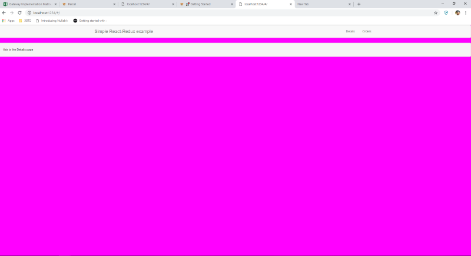
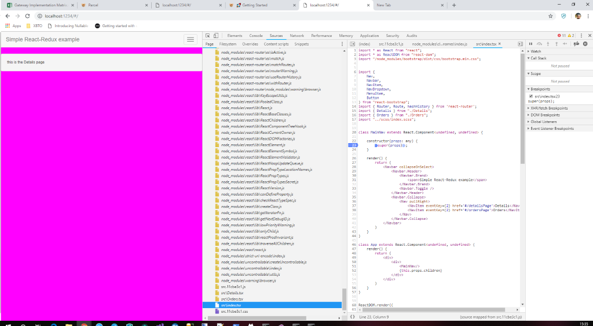

# Overview

A simple project using React/Typescript/Babel with [https://parceljs.org/](https://parceljs.org/)

Ensure you have done the following 

- `npm install`
- `npm install -g parcel-bundler`
- open directory to wwwroot folder in nodeJS command prompt and issue this command `parcel index.html`
- open browser and you should see the following

See how source maps are on my default

This tiny demo, demonstrates a few things

- Typescript transpiling
- Modules
- Node modules getting loads
- SCSS
- React typescript
- React Redux

All with no config

## PROD Release ##
For prod you would likely want to use the following command `parcel index.html --no-source-maps`. You can read more on the ParcelJs CLI section : [https://parceljs.org/cli.html](https://parceljs.org/cli.html)